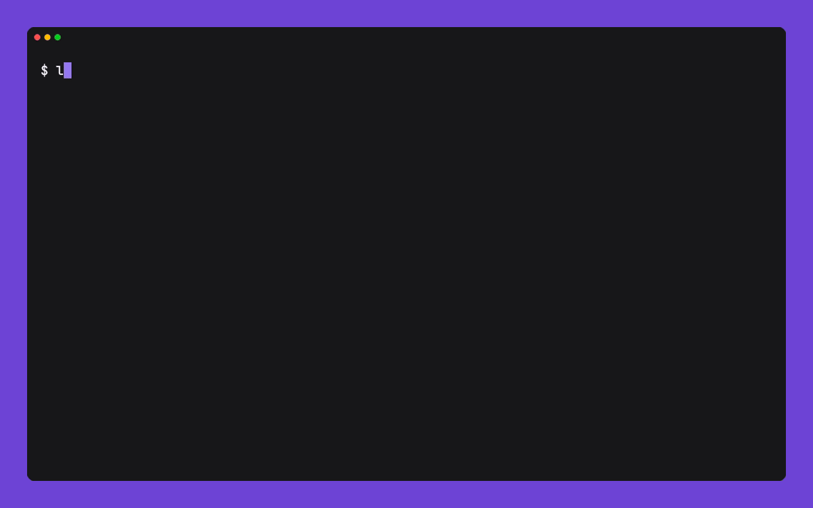

# ☞ lookit

A finger client built for exploring, not just querying.

<p align="center">
  <a href="https://github.com/jonathandeamer/lookit/releases"></a>
  <a href="https://github.com/jonathandeamer/lookit/actions/workflows/ci.yml"></a>
</p>

<p align="center">
  
</p>

Finger is one of the oldest things on the internet ([RFC 1288](https://www.rfc-editor.org/rfc/rfc1288), TCP port 79): ask a server about a person and it tells you who they are, whether they're logged in, and whatever they've left in their `.plan` file.

It faded once the web arrived, but never died. On the small internet, [tilde communities](https://tildeverse.org/) and [pubnixes](https://tilde.wiki/Public_Access_Unix_System) still run finger servers, and people keep a `.plan` as a slow, personal microblog. lookit is for poking around that world.

## What lookit does

While the `finger` command is built around querying a specific address, lookit is built for exploring when you don't know where you're going.

It doesn't show you anything `finger` couldn't — `finger @host` has always listed who's around. What it adds is movement: the user list is selectable, links inside a response are drillable, and you can walk back through where you've been without re-fetching. It turns a string of one-off commands into one session.

It's built on the [Charm](https://charm.sh) stack, so it behaves like the TUIs you already use and adapts to light or dark terminals.

## Install

The prebuilt binaries are the simplest option and need no Go installed. Grab the archive for your OS and architecture from the [Releases page](https://github.com/jonathandeamer/lookit/releases), unpack it, and move the `lookit` binary onto your `PATH`. This is the recommended approach on a tilde or pubnix box, where the system Go is often too old to build from source.

With Go 1.21 or newer you can install from source instead:

```bash
go install github.com/jonathandeamer/lookit@latest
```

Or clone the repo and run `go build .`.

## Usage

```bash
lookit                       # open the browser
lookit jonathan@tilde.team   # open it on one person
lookit @plan.cat             # open it on a host, then browse its users
lookit @tilde.team:79        # spell out the port (79 is the default)
lookit --version
```

Type a target and press Enter to fetch it. Finger a bare `@host` and, when it answers with a list of users, lookit opens that list: move with the arrows, `/` to filter, Enter to finger whoever's highlighted. Enter on a user drills in, Esc walks back through where you've been, and Ctrl+C quits.

Everything is keyboard-driven. Press `?` inside lookit for the full, context-aware key list.

## What lookit is not

- A finger server. It won't host your `.plan` or answer anyone's queries; that job belongs to `fingerd`. lookit only reads.
- A way to write: it doesn't post or edit.
- A background process. Nothing polls and nothing runs as a daemon.
- A general small-web browser. It speaks finger and follows `finger://` links, but won't fetch gopher, gemini, or the web.

## Coming soon
- Richer styling and link discovery, tuned to how today's finger servers format their menus and links.
- Discovery and subscriptions: finding finger hosts worth a visit, and following a `.plan` to see what's changed since you last looked.
- Maybe a local mode: finger the machine you're already on, reading its users and `.plan` files straight off disk with no network round-trip.

## Built with

lookit is built with [Charm](https://charm.sh) tools: [Bubble Tea](https://github.com/charmbracelet/bubbletea), [Bubbles](https://github.com/charmbracelet/bubbles), and [Lip Gloss](https://github.com/charmbracelet/lipgloss); the demo gif above was recorded with another Charm tool, [VHS](https://github.com/charmbracelet/vhs). It speaks [RFC 1288](https://www.rfc-editor.org/rfc/rfc1288) finger over TCP/79.

## Contributing

Bug reports, ideas, and PRs are welcome. See [CONTRIBUTING.md](CONTRIBUTING.md).

## License

[MIT](LICENSE) © 2026 Jonathan Deamer.
