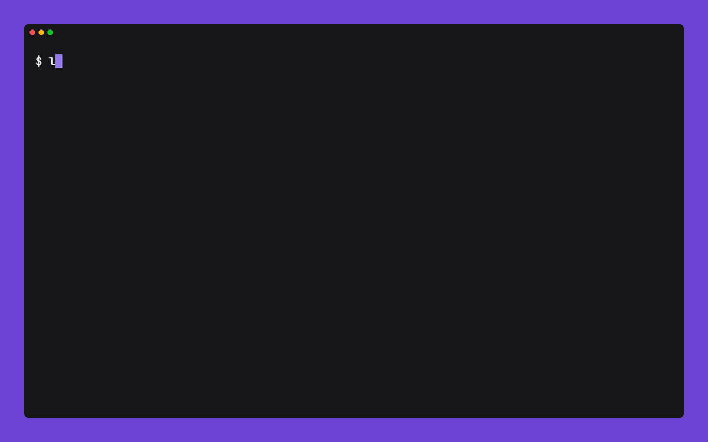

# ☞ lookit

A modern TUI browser for the finger protocol.

<p align="center">
  <a href="https://github.com/jonathandeamer/lookit/releases"></a>
  <a href="https://github.com/jonathandeamer/lookit/actions/workflows/ci.yml"></a>
</p>

<p align="center">
  
</p>

Finger is one of the oldest things on the internet ([RFC 1288](https://www.rfc-editor.org/rfc/rfc1288), TCP port 79): ask a server about a person and it tells you who they are, whether they're logged in, and whatever they've left in their `.plan` file.

It faded once the web arrived, but never died. On the small internet, [tilde communities](https://tildeverse.org/) and [pubnixes](https://tilde.wiki/Public_Access_Unix_System) still run finger servers, and people keep a `.plan` as a slow, personal microblog. lookit is for poking around that world.

## Browsing with lookit

`finger @host` has always listed who's around. When a response looks like a user list, lookit makes it selectable. You can follow links inside responses, and the in-session history lets you go back without sending another query. lookit turns one-off `finger` commands into a browsing session.

Run lookit without a target and it opens on a built-in catalog of finger communities and services, with your own bookmarks above it. Give it a target and it opens there instead.

It adapts to light and dark terminals and leaves the mouse free for native selection and copy.

## Install

Take a `.deb`, `.rpm`, or archive for your platform from the [Releases page](https://github.com/jonathandeamer/lookit/releases). These need no Go, which matters on a tilde or pubnix box where the system Go is often too old.

The Linux packages install the manual for you. From an archive, put both files where they belong:

```bash
tar xzf lookit_*.tar.gz
mkdir -p ~/.local/bin ~/.local/share/man/man1
mv lookit ~/.local/bin/
mv man/lookit.1 ~/.local/share/man/man1/
```

With Go 1.25 or newer:

```bash
go install github.com/jonathandeamer/lookit@latest
```

`go install` copies the binary only and does not include the manual. Run `man lookit` after installing from a Linux package or with the archive commands above. From an unpacked archive or clone, read the page in place with `man ./man/lookit.1`. `lookit(1)` is the full reference.

## Usage

```bash
lookit                       # open the browser and view the catalog
lookit jonathan@tilde.team   # open it on one person
lookit @plan.cat             # open it on a host, then browse its users
```

`lookit --help` covers target syntax. Inside lookit, `?` shows the keys available on the current screen, including how to filter a list, wrap long prose, and refresh a response.

## Bookmarks

lookit stores bookmarks in `~/.config/lookit/bookmarks`, or in `$XDG_CONFIG_HOME/lookit/bookmarks` when that variable is set. The file is plain text and yours to edit; lookit preserves comments and ordering. It records when you last visited a bookmark and normally puts whatever you haven't checked in a while at the top.

Put `catalog off` on its own line to hide the built-in catalog, or `sort manual` to keep the file's order. lookit rereads the file whenever you return to the startpage, so you can edit it while lookit is running. The file explains its format in a header comment; `lookit(1)` has the full reference.

## lookit is for reading finger

lookit reads finger servers and follows `finger://` links. It does not host or edit `.plan` files, run a daemon, or fetch Gopher, Gemini, or web pages. Use `fingerd` to serve a `.plan`.

## Built with

lookit is built with [Charm](https://charm.sh)'s [Bubble Tea](https://github.com/charmbracelet/bubbletea), [Bubbles](https://github.com/charmbracelet/bubbles), and [Lip Gloss](https://github.com/charmbracelet/lipgloss). The demo was recorded with [VHS](https://github.com/charmbracelet/vhs).

## Contributing

Bug reports, ideas, and PRs are welcome. See [CONTRIBUTING.md](CONTRIBUTING.md).

## License

[MIT](LICENSE) © 2026 Jonathan Deamer.
